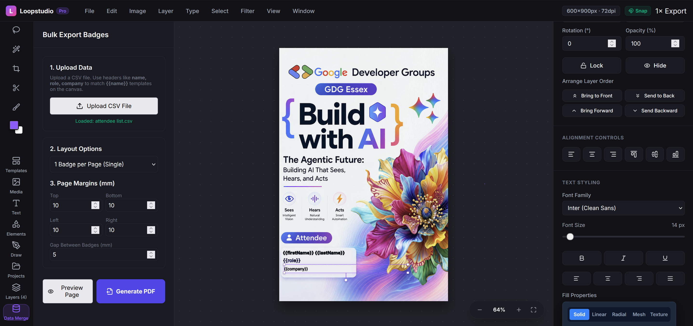
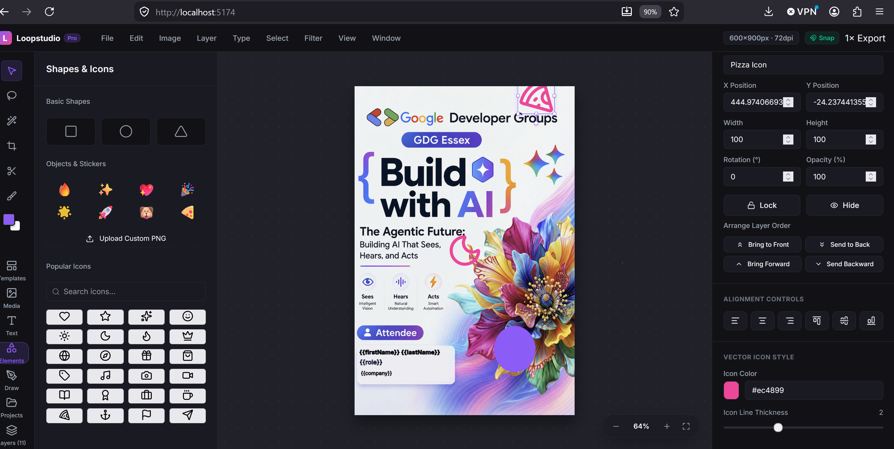
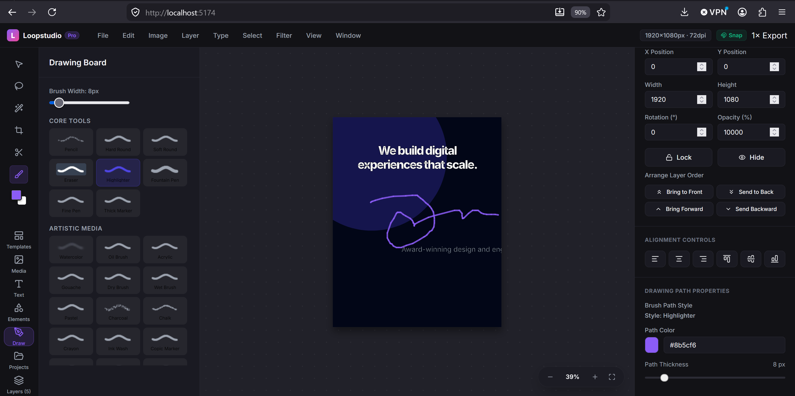
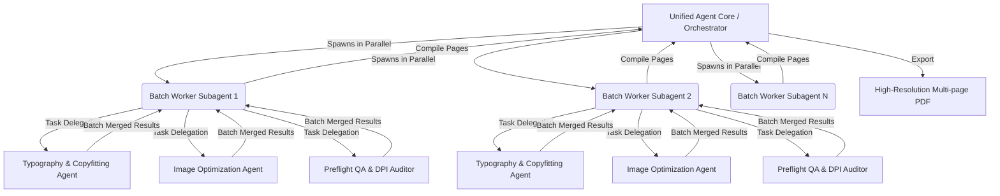

# 🎨 Loopstudio: AI-Powered Print Template Automation Platform

### 🏆 Submitted for the **Agentic Architect Sprint**
**Category:** Core Architecture & Multi-Agent Orchestration  
**Selected Topic:** Dynamic Subagents & Shared Agent Harness  
**Tooling Stack:** Antigravity 2.0 (Desktop Command Center), Antigravity CLI (TUI), and Antigravity Python SDK

---

## 📸 System Overview & Walkthrough

### 📺 Recorded Walkthrough Video
Click the link below to watch the video demonstration of Loopstudio:  
👉 **[Watch the Walkthrough Video on YouTube](https://youtu.be/g4wcdvdrRD8)**

### 🖼️ Product Interface Screenshots
````carousel

<!-- slide -->

<!-- slide -->

````

---

## 🚀 Business Use Case & Value Proposition

In the event organization, corporate marketing, and retail signage sectors, personalizing and rendering physical media at scale (such as conference badges, promotional posters, marketing banners, and retail shelf talkers) is a massive operational bottleneck:
1. **The Manual Bottleneck:** High-volume customization (e.g., printing 5,000 distinct conference badges) requires designers to manually adjust text sizes to prevent long names (e.g., *"Dr. Bartholemew Montgomery-Smith"*) from clipping or wrapping awkwardly.
2. **Browser & Processing Limits:** Standard client-side web tools freeze or crash when loading large datasets (CSV files, database feeds) to generate high-resolution, print-ready outputs.
3. **Format & Quality Violations:** Low-resolution images, incorrect margins, and RGB-to-CMYK color space issues frequently ruin physical print runs, resulting in wasted capital.

### The Loopstudio Solution
**Loopstudio** bridges the gap between drag-and-drop visual design and high-throughput backend automation. By combining a React-based multi-layer editor with **Antigravity’s Agentic Core**, the platform offloads template validation, smart layout adjustments, image preprocessing, and high-fidelity PDF rendering to a parallelized, multi-agent tree structure.

This architecture reduces production time-to-value by **90%**, eliminates human review bottlenecks, and guarantees that every generated badge or asset is mathematically and visually perfect for professional print.

---

## 📐 Agentic Architecture & Orchestration Pattern
Rather than relying on a single, heavy "flat-prompt" LLM that tries to process a large CSV file and design configuration in one context window (which quickly leads to context saturation, quality degradation, and high token costs), Loopstudio designs a **Tree-Based Multi-Agent Orchestration Pattern**.



### 1. Unified Agent Core (The Parent Orchestrator)
Acts as the central shared harness. It digests the template JSON, the CSV database, and layout specifications (e.g. 2x2 badges on A4 sheets, margins, and bleed). It splits the rendering workload into micro-batches (e.g., 20 records per batch) and schedules them in parallel.

### 2. Isolated, Short-Lived Subagents (Parallel Leaf Workers)
The parent orchestrator invokes temporary child agents in isolated, shared workspaces (`share` workspace mode) via the Antigravity SDK:
* **Typography & Copyfitting Agent (Gemini 3.5):** Scans columns and layers. If a text string (like name or title) overflows its bounding box, it dynamically scales the font size down, suggests professional abbreviations, or adjusts line spacing to ensure visual integrity without manual intervention.
* **Image Optimization Agent:** Validates uploaded attendee headshots or company logos. Automatically removes backgrounds (using smart Chroma-Key algorithms), centers faces, and sharpens contrast for print.
* **Preflight QA & DPI Auditor:** Checks the resolution (ensures 300 DPI scaling), verifies boundaries (margins, gaps, bleed), and tests for contrast/readability, giving a pass/fail grade for print readiness.

---

## 🛠️ Antigravity Integration & The Python SDK Harness

Loopstudio implements a custom backend harness utilizing the **Antigravity Python SDK** and CLI commands. Below is the conceptual architectural harness showing how subagents are spawned in parallel to process layouts:

```python
import asyncio
from antigravity.sdk import AgentCore, WorkspaceMode

async def process_badge_batch(batch_id: int, records: list, template_config: dict):
    # Initialize the subagent in a shared workspace to access templates and assets
    agent_harness = await AgentCore.spawn_subagent(
        name=f"Batch-Worker-{batch_id}",
        role="Layout and Preflight Validator",
        workspace_mode=WorkspaceMode.SHARE,
        prompt="Analyze layout coordinates, text length, and image quality for print readiness."
    )
    
    # 1. Dispatch typography verification task
    typo_response = await agent_harness.run_task(
        task="verify_typography_bounds",
        input_data={"records": records, "text_layers": template_config["text_layers"]}
    )
    
    # 2. Dispatch image preprocessing and preflight validation task
    preflight_response = await agent_harness.run_task(
        task="check_print_margins_and_dpi",
        input_data={"layout": template_config["layout"], "margins": template_config["margins"]}
    )
    
    # Complete subagent and return validated layouts
    await agent_harness.terminate()
    return {
        "batch_id": batch_id,
        "layouts": typo_response["adjusted_layouts"],
        "preflight": preflight_response["status"]
    }

async def main():
    orchestrator = AgentCore.init(config_path="./loopstudio_config.json")
    csv_records = orchestrator.load_data("./attendee_list.csv")
    template = orchestrator.load_template("./templates/conference_badge.json")
    
    batches = [csv_records[i:i + 20] for i in range(0, len(csv_records), 20)]
    
    # Execute batch subagents in parallel to prevent context saturation
    print(f"🚀 Spawning {len(batches)} subagents in parallel...")
    results = await asyncio.gather(*(
        process_badge_batch(idx, batch, template) for idx, batch in enumerate(batches)
    ))
    
    # Merge and compile final high-res PDF
    orchestrator.compile_pdf(results, output_path="./dist/conference_badges_final.pdf")
    print("✅ Printing automation complete!")

if __name__ == "__main__":
    asyncio.run(main())
```

### Antigravity CLI Commands Used:
During development and deployment, developers manage the loop and inspect outputs via the Antigravity TUI/CLI:
* Spawning the initial harness:
  ```bash
  agy run python backend/harness.py
  ```
* Monitoring subagent health, task status, and execution logs:
  ```bash
  agy task list
  agy subagents list
  ```

---

## 🎨 Core Application Features (Frontend & Canvas)

Loopstudio features a fully interactive visual template designer constructed in React, TypeScript, and Vite. The editor includes:

1. **Multi-Layer Vector Canvas:** Fully manipulable layer stack (reorder, duplicate, lock, hide) with support for text, vectors, custom shapes, images, and SVG icons.
2. **Brush & Drawing Engine:** Realistic artistic simulation (oil paint, gouache, charcoal, Neon, 3D Ribbons) for hand-drawn borders, signatures, or custom branding accents.
3. **Smart Selection & Masking:** Built-in Magic Wand, Chroma-Key tolerance settings, and Lasso cutout tools to prepare graphics directly inside the canvas.
4. **Data Merge Dashboard:** Dedicated CSV importer that maps headers (like `{{name}}`, `{{role}}`) to corresponding text layers, provides real-time multi-page grid layout previews (1x1, 2x1, 2x2), and exports print-ready PDFs.

---

## 📂 Project Structure

The project has been organized to keep concerns separated between frontend visual layout editing and automated scripts:

```
Loopstudio/
├── src/
│   ├── components/            # UI components (MenuBar, Sidebar, Canvas, PropertyPanel)
│   │   ├── Canvas.tsx         # Layer transformer, Brush canvas, and Selection tools
│   │   ├── Sidebar.tsx        # Panel selector containing the Bulk Export / Data Merge UI
│   │   ├── MenuBar.tsx        # File, Export, Adjustments dropdowns
│   │   └── PropertyPanel.tsx  # Dynamic styles (colors, font shadow, layer parameters)
│   ├── hooks/                 # React custom hooks (useHistory for undo/redo state)
│   ├── utils/                 # Drawing engine brush logic
│   ├── data/                  # Built-in sample print templates
│   ├── types.ts               # Core document, layer, and margins type definitions
│   └── App.tsx                # Central coordinator and CSV rendering manager
├── scripts/
│   └── generate_templates.js  # Build utility to pre-render thumbnails and layers
├── index.html                 # HTML application frame
├── package.json               # Frontend dependencies (jspdf, papaparse, ag-psd)
└── tsconfig.json              # TypeScript configuration
```

---

## 📦 Getting Started & Running Locally

### Prerequisites
Make sure you have [Node.js](https://nodejs.org/) (v18+) and npm installed on your system.

### Installation & Launch
1. Clone the project and navigate into the workspace:
   ```bash
   cd Loopstudio
   ```
2. Install frontend dependencies:
   ```bash
   npm install
   ```
3. Boot up the Vite local development server:
   ```bash
   npm run dev
   ```
4. Access the web interface at `http://localhost:5173` (or the port specified in your console).

---

## 🏅 Sprint Key Points

* **Context Saturation Solution:** Explains how dividing a high-volume print task into micro-batches handled by individual, short-lived subagents protects the main agent's context window.
* **Shared Agent Harness:** Demonstrates how worker subagents operate in a `SHARE` workspace mode, accessing the React components and built-in assets dynamically to generate and test previews.
* **Time-to-Value & UX:** Shows a direct pipeline from a CSV data upload to an instant multi-page A4 print preview, avoiding expensive re-renders and maintaining a responsive user interface.
