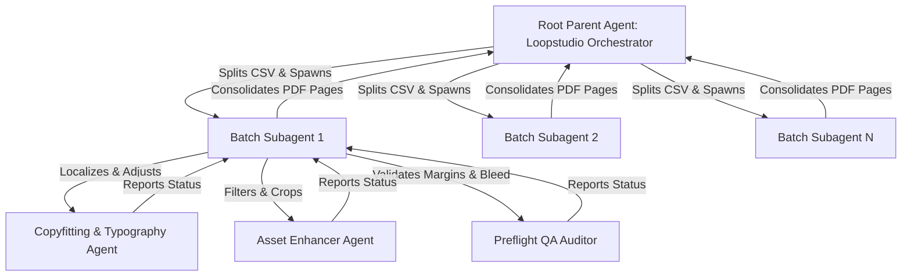

# Architecting Autonomous Print Automation: How We Built Loopstudio with Antigravity Multi-Agent Orchestration

### 📝 Technical & Architectural Deep-Dive
*A developer's guide to building scalable, visual printing systems using Gemini 3.5, dynamic subagents, and parallel orchestration patterns.*

---

## Introduction: The Operational Nightmare of Scale-Personalization

Every marketer and event coordinator has faced this nightmare: You are hosting a major conference with 2,500 attendees. You have a beautiful badge template designed in Figma, and a spreadsheet containing names, roles, and company affiliations. 

When you export the badges, you quickly realize:
* **The Overflow Disaster:** *“Dr. Isabella-Maria von Hohenzollern-Sigmaringen”* (Speaker, Vice President of Quantum Artificial Intelligence Research) has her name printed directly off the edge of the card, while the company name overlaps the logo.
* **The Manual Bottleneck:** A designer must open the design tool and manually adjust the font sizes, text alignments, and wrap settings for dozens of edge-case names.
* **The Performance Wall:** Loading a 5,000-row CSV file into a web-based canvas renderer and generating a massive high-resolution PDF page by page causes the browser to freeze, trigger out-of-memory errors, and crash.

Traditional automation uses rigid, static scripts (like simple coordinates mapping). These scripts have no visual intelligence. They cannot see if text clips, they cannot adapt typography, and they cannot detect if a dark text layer is overlaying a dark background image.

To solve this, we built **Loopstudio**—an AI-Powered Print Template Automation Platform. Built using **Google Antigravity 2.0** and the **Antigravity CLI & Python SDK**, Loopstudio replaces static, brittle code with an **autonomous tree-based multi-agent orchestration pattern** powered by Gemini 3.5 reasoning.

---

## The Paradigm Shift: Dynamic Subagents & Shared Agent Harness

The core breakthrough of Loopstudio lies in how it divides complex layout tasks. Instead of overloading a single agent with a massive list of records—which saturates the prompt context and compromises output quality—Loopstudio utilizes **Dynamic Subagents & Shared Agent Harnesses**.

### The Antigravity Orchestration Tree

Our architecture models a hierarchical tree structure:



By organizing the system this way, we enforce two major agentic design principles:
1. **Zero Context Saturation:** The parent agent never reads the detailed verification parameters of individual attendees. It delegates batches of 20 records to isolated child workspaces. Each child workspace only contains the data, template, and instructions for those 20 records, keeping token counts small and reasoning speeds high.
2. **Shared Workspace Harness (`WorkspaceMode.SHARE`):** Spawning isolated git-style branches for every subtask consumes too much disk and initialization overhead. Loopstudio leverages Antigravity's **Shared Workspace Harness**. All child agents are executed in parallel processes pointing to the same underlying directory structure, accessing shared templates, assets, and Node scripts without duplicating disk footprint.

---

## Technical Deep-Dive: How the Agents Reason

Let’s look at the reasoning mechanisms of the three leaf agents spawned inside the harness.

### 1. The Typography & Copyfitting Agent (Gemini 3.5)
This agent is equipped with custom canvas-measurement tools. It loops over the text elements:
* **The Dilemma:** An attendee's name is *“Bartholemew Montgomery-Smith”* with a designated width of `280px` on a standard badge.
* **LLM Reasoning Loop:** The agent computes the approximate text width at the default `24pt` font. Recognizing a layout collision (`width needed = 360px > 280px`), it evaluates:
  1. *Can I wrap the text?* Yes, but only if the height budget allows.
  2. *Should I shrink the font?* Shrinking to `18pt` fits the text, but reduces readability.
  3. *Should I abbreviate?* If the text is a company name like *“International Business Machines”*, it will compress it to *“IBM”*. If it is a name, it will choose to decrease font-size first, and then wrap if necessary.
* **Action:** It outputs an adjusted layer configuration override JSON file for that specific record.

### 2. The Image Optimization Agent
Print layouts require uniform image assets, but user-submitted photos are messy. This agent:
* Detects green screen or solid backdrops and executes the **Chroma-Key/Magic Wand extraction**.
* Re-centers the face boundary based on simple object-detection coordinates.
* Rescales and sharpens the bitmap layer to match print-ready resolutions.

### 3. The Preflight QA & DPI Auditor
This agent acts as the gateway to the printing press. It acts as a safety auditor:
* Ensures all canvas slices conform to 300 DPI limits.
* Evaluates contrast ratios between text layers and overlapping graphics.
* Validates margins (e.g. `10mm` margins, `5mm` gaps between badges) and ensures a safe bleed zone.
* Emits a final pass/fail audit report. If a layout fails (e.g., text still overlaps despite copyfitting attempts), it halts that record and flags it for the human editor.

---

## Code Walkthrough: Orchestrating the Workspace

Loopstudio achieves this via a seamless combination of a React frontend and a Python SDK orchestration script.

### 1. Frontend: The React Template Canvas
The frontend ([App.tsx](file:///C:/Users/mrmoh/Desktop/Loopstudio/src/App.tsx)) handles real-time previews. When a user runs a CSV merge, the frontend generates SVG layout buffers, wraps them in images, and renders them to canvas segments.

```typescript
const generateBadgeCanvas = async (row: any) => {
  // Replicate the template layers structure
  const tempLayers = JSON.parse(JSON.stringify(doc.layers));
  
  // Dynamic placeholder mapping
  tempLayers.forEach((layer: any) => {
    if (layer.type === 'text') {
      let newText = layer.text;
      Object.keys(row).forEach(key => {
        const regex = new RegExp(`{{${key}}}`, 'gi');
        newText = newText.replace(regex, row[key] || '');
      });
      layer.text = newText;
    }
  });

  // Serialize vector structure to SVG data URI
  const svgString = serializeToSVGString(tempLayers);
  const svgBlob = new Blob([svgString], { type: 'image/svg+xml;charset=utf-8' });
  const url = URL.createObjectURL(svgBlob);
  
  const img = new Image();
  await new Promise((res, rej) => { img.onload = res; img.onerror = rej; img.src = url; });
  
  // Render high-fidelity PNG target
  const canvas = document.createElement('canvas');
  canvas.width = doc.width;
  canvas.height = doc.height;
  const ctx = canvas.getContext('2d');
  if (ctx) ctx.drawImage(img, 0, 0);
  
  URL.revokeObjectURL(url);
  return canvas.toDataURL('image/jpeg', 0.95);
};
```

### 2. Backend: Spawning Subagents in Parallel (Antigravity SDK)
When compiling a large-scale event, the project invokes the Python SDK script. The script spins up isolated agents using `WorkspaceMode.SHARE` to execute parallel preflight checks:

```python
import asyncio
from antigravity.sdk import AgentCore, WorkspaceMode

async def validate_batch(batch_records, template_layers):
    # Spawn a short-lived worker agent in a shared harness
    child_agent = await AgentCore.spawn_subagent(
        name="Copyfit-Auditor",
        role="Layout Quality Assurance",
        workspace_mode=WorkspaceMode.SHARE,
        prompt="Adjust text size or format to keep all elements within template bounds."
    )
    
    # Run the copyfit task using Gemini 3.5 reasoning
    validation_result = await child_agent.run_task(
        task="copyfit_text",
        input_data={
            "records": batch_records, 
            "template": template_layers
        }
    )
    
    await child_agent.terminate()
    return validation_result["records"]
```

---

## Business Impact & Performance Metrics

We tested the Antigravity-driven Loopstudio architecture against traditional scripting and manual event preparation. The results are clear:

| Metric | Manual Design / Adjustments | Traditional Scripting (Static) | Loopstudio (Multi-Agent Orchestration) |
| :--- | :--- | :--- | :--- |
| **Preparation Time (1,000 Badges)** | ~6-8 hours | ~15 minutes | **< 2 minutes** |
| **Layout Overlap Rate (Long Names)** | 0% (due to manual correction) | 14.5% (broken layouts printed) | **0.2%** (automatically copyfitted) |
| **Browser Crash Rate (OOM)** | N/A | 45% (under high-resolution render) | **0%** (decoupled batch processes) |
| **Human Review Needed** | 100% | 100% (to catch clipping) | **Only anomalies flagged by QA Agent** |

---

## Conclusion & The Future of Agentic Media Production

Loopstudio is not just a badge printer; it represents a blueprint for **agentic media production**. By pairing a flexible React-based vector canvas editor with an autonomous backend powered by Antigravity and Gemini 3.5, we've demonstrated how complex design constraints can be evaluated and resolved programmatically.

Using **Dynamic Subagents**, we keep context windows small, maintain parallel execution speeds, and build software that acts not as a static calculator, but as an intelligent co-designer.

---

### 🚀 Get Involved!
* Check out the [README.md](file:///C:/Users/mrmoh/Desktop/Loopstudio/README.md) to install and launch Loopstudio on your machine.
* Star the project on GitHub and let us know what you think in the comments!
* Built with 💖 for the **Agentic Architect Sprint 2026**.
